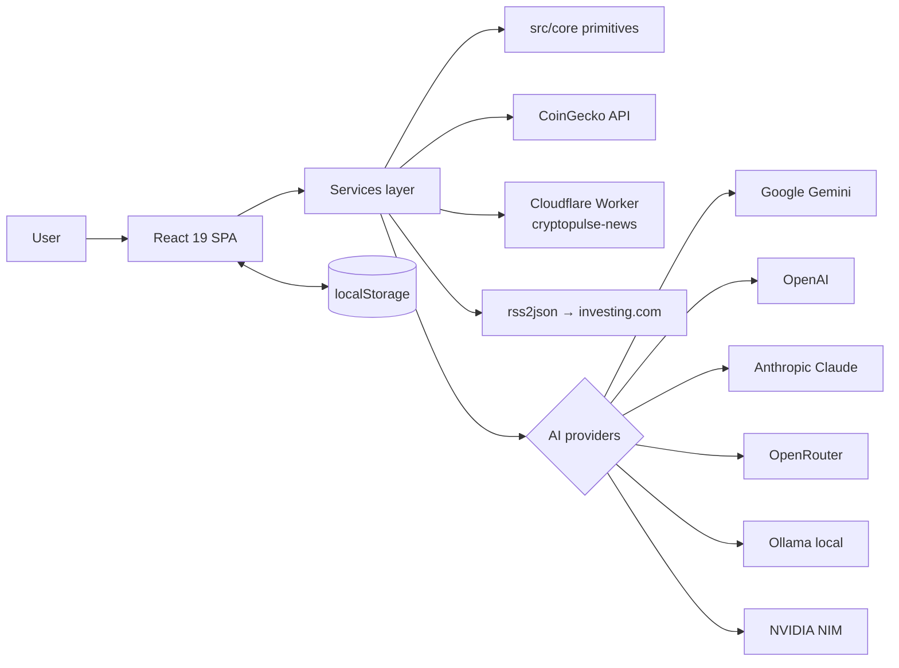
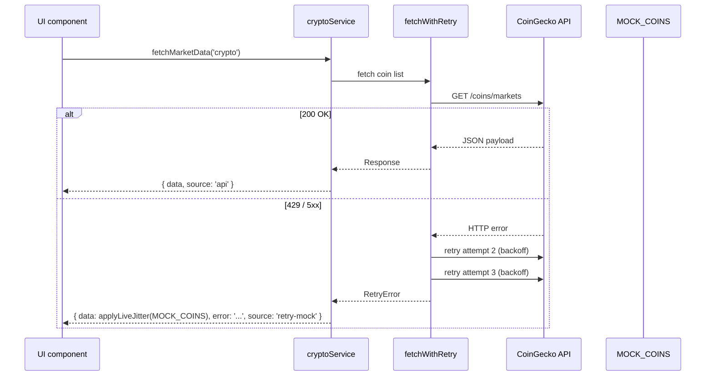
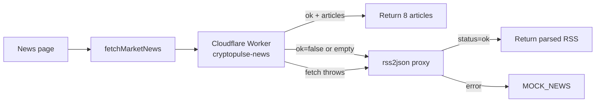

# Architecture

CryptoPulse 2077 is a **client-only** fintech SPA. There is no traditional backend — all state lives in the browser (localStorage + IndexedDB), and external services are reached directly or via lightweight Cloudflare Workers.

This document describes the three layers that matter for understanding how data flows through the app, and the engineering decisions that shape them.

---

## 1. Layer overview



### Layer responsibilities

| Layer | What lives here | What does **not** |
|---|---|---|
| **UI** (`src/components`, `src/pages`) | React 19 + Tailwind + Recharts components, routing, visuals | No direct `fetch()`, no business rules, no mutation of storage |
| **Services** (`src/services`) | API calls, mock fallbacks, provider dispatch, business logic | No JSX, no React hooks except within custom hooks |
| **Core** (`src/core`) | Reusable primitives with zero UI/business coupling (`retry.ts`) | No imports from `services/` or `components/` |

The core layer is deliberately small — it's where code goes when we discover it's reusable **across projects**, not just inside CryptoPulse.

---

## 2. Market data pipeline



### Source tagging

Every `ServiceResponse<T>` carries a required `source: DataSource` field:

| source | Meaning | Typical UI badge |
|---|---|---|
| `'api'` | Real data from the upstream API on the current call | 🟢 LIVE |
| `'mock'` | Built-in static data (forex/futures have no real API yet) | ⚪ MOCK |
| `'retry-mock'` | Real API was tried, retry exhausted, fell back to mocks | 🟡 RETRY |

Why this matters:
- Previously, callers couldn't distinguish "live BTC price" from "cached mock fallback" — both looked the same. That's a classic silent-fallback antipattern.
- With `source`, the UI can render a badge, tests can assert deterministically, and telemetry can report real API availability separately from cache hits.

### Retry strategy

`fetchWithRetry` wraps `fetch()` with `src/core/retry.ts`:

- **Max attempts:** 3
- **Backoff:** exponential, 500ms → 1000ms → 2000ms, capped at 4000ms
- **Jitter:** ±50% to avoid thundering-herd on shared rate limits
- **Retryable:** HTTP 408, 425, 429, 500, 502, 503, 504
- **Non-retryable:** everything else (passes through to the caller's fallback branch)

The `src/core/retry.ts` module is **byte-identical** to the copy in [Eclipse Valhalla](https://github.com/PavelHopson/Eclipse-Valhalla). This is intentional: both projects will eventually pull it from a shared npm package ([`@pavelhopson/retry-http`](https://github.com/PavelHopson) — planned). Zero-delta port proves the module was designed as standalone from day one.

---

## 3. AI provider pipeline

```mermaid
flowchart TD
    Entry[generateCoinAnalysis] --> Config[getAIConfig]
    Config --> Profile{User profile<br/>has AI config?}
    Profile -->|yes| UseProfile[Use profile.preferences.ai]
    Profile -->|no| EnvFallback[Use env API_KEY + gemini]
    UseProfile --> Dispatch[PROVIDERS[config.provider]]
    EnvFallback --> Dispatch
    Dispatch --> G[callGemini]
    Dispatch --> O[callOpenAI]
    Dispatch --> A[callAnthropic]
    Dispatch --> R[callOpenRouter]
    Dispatch --> L[callOllama]
    Dispatch --> N[callNvidia]
```

### Supported providers

| Provider | Endpoint | Auth | Free tier | Notes |
|---|---|---|---|---|
| **Google Gemini** | via `@google/genai` SDK | API key | Yes (AI Studio) | Default fallback; loads SDK dynamically |
| **OpenAI** | `api.openai.com/v1/chat/completions` | Bearer | No | Standard Chat Completions |
| **Anthropic Claude** | `api.anthropic.com/v1/messages` | `x-api-key` | No | Requires `anthropic-dangerous-direct-browser-access` |
| **OpenRouter** | `openrouter.ai/api/v1/chat/completions` | Bearer | Partial | Routes through 100+ models; requires `HTTP-Referer` |
| **Ollama (local)** | `localhost:11434/api/generate` | None | Fully local | Appends uncensored-mode preamble for abliterated/huihui models |
| **NVIDIA NIM** | `integrate.api.nvidia.com/v1/chat/completions` | Bearer | **Yes** (build.nvidia.com) | OpenAI-compatible format; 5 preset models |

The `PROVIDERS: Record<AIProvider, ...>` map is an **exhaustive TypeScript record**. Adding a new provider to the `AIProvider` union forces a compile error until you register its handler — this caught the NVIDIA NIM addition automatically.

### Error propagation

- A provider handler **throws** → caller catches → UI shows `Ошибка AI (${provider}): ${message}`
- Missing API key (non-ollama) → short-circuit with "AI не настроен" message before any network call
- NVIDIA NIM reads both `error.message` and `detail` fields (endpoint varies by model)

---

## 4. News pipeline



Three-tier fallback: **Worker → RSS proxy → in-memory mocks**. Each tier is tested against its happy path, fall-through, and throw paths.

- **Worker** (primary): custom Cloudflare Worker at `cryptopulse-news.hopsintoxin.workers.dev/crypto` parses CoinTelegraph + CoinDesk + investing.com in real time. Free tier (100k requests/day).
- **RSS proxy** (fallback): `api.rss2json.com` over investing.com RU RSS, with HTML-stripping and relative date formatting (`N мин назад`, `N ч назад`, or localized short date).
- **Mocks** (last-resort): two hardcoded stories so the UI never shows an empty state.

---

## 5. Storage

All persistence lives in the browser:

| Key | Purpose |
|---|---|
| `localStorage['cryptopulse_user']` | User profile including `preferences.ai` (API keys stay here, never sent to any backend we control) |
| `localStorage['cryptopulse_portfolio']` | Simulated portfolio positions |
| `localStorage['cryptopulse_favorites']` | Favorite asset IDs |
| `localStorage['cryptopulse_system_config']` | Admin overrides for volatility/bias (dev panel only) |

There is deliberately **no server-side user database**. Account creation is local-only (SHA-256 password hash via Web Crypto API). This is a product constraint — the app is intended to run on Cloudflare Pages with zero backend cost — not a security oversight.

---

## 6. Testing strategy

Four test files covering the full services layer:

| File | Tests | What it locks down |
|---|---:|---|
| `src/core/retry.test.ts` | 26 | Exponential backoff math, jitter range, abort semantics, RetryError invariants |
| `src/services/cryptoService.test.ts` | 19 | Every branch through `source` tagging, retry-on-429/503, non-retryable 404, mock fall-through |
| `src/services/aiService.test.ts` | 19 | All 6 provider handlers, error paths, prompt construction, Gemini SDK mock via class (not `vi.fn()`) |
| `src/services/newsService.test.ts` | 12 | Worker primary path, RSS fallback, mock last-resort, date formatting |
| **Total** | **76** | |

**Mocking patterns:**
- `vi.stubGlobal('fetch', fetchMock)` for HTTP isolation
- `vi.mock('./userService', ...)` with mutable `profileHolder` so each test can swap config
- `vi.mock('@google/genai', { GoogleGenAI: class { ... } })` — plain class, because `vi.fn()` isn't a real constructor
- `vi.mock('./adminService', ...)` to pin `applyLiveJitter` determinism

Tests use real timers and real retry delays (~10s total). A future optimization could inject retry options or use fake timers, but for 76 tests at ~10s wall time the CI impact is acceptable.

---

## 7. Deployment

- **Hosting:** Cloudflare Pages at `cryptopulse-1d0.pages.dev`
- **Build:** `npm run build` — Vite production build, outputs to `dist/`
- **CI:** `.github/workflows/ci.yml` runs `typecheck → test → build` on every PR + push to main

No secrets are injected at build time — API keys are supplied by the user at runtime via the Settings page.

---

## 8. What this architecture is **not** good for

Being honest about trade-offs:

- **No cross-device sync.** All state is per-browser. A user who installs the PWA on a new device starts fresh.
- **API keys are client-side.** If a user opens DevTools, they can read their own keys. This is fine because keys are the user's own, but it means we can't offer "free AI access" paid for by the project.
- **No server-side rate limiting.** If a hostile user spams the CoinGecko free tier through the client, only the retry backoff and CoinGecko's own rate-limit will stop them.

Each of these is a deliberate choice in service of a zero-backend, zero-cost, privacy-first deployment model. If any becomes a real constraint, the services layer is structured so a Cloudflare Workers backend could intercept and proxy — the `fetchWithRetry` wrapper is the natural place to inject that.
